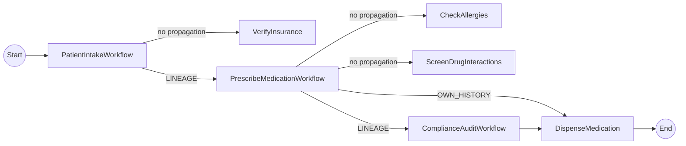

# Workflow History Propagation

This tutorial demonstrates **workflow history propagation**, a Dapr 1.18 feature that lets a parent workflow share its execution history with child workflows and activities. Downstream services can inspect the propagated history to make trust-aware decisions — without any external state store or custom messaging.

> **Runtime requirement**: Dapr 1.18+ ([dapr/dapr#9810](https://github.com/dapr/dapr/pull/9810))
> **Java SDK requirement**: `dapr-spring-bom >= 1.18.0-rc-2` ([dapr/java-sdk#1739](https://github.com/dapr/java-sdk/pull/1739), backported in [dapr/java-sdk#1751](https://github.com/dapr/java-sdk/pull/1751))
> **Proposal**: [dapr/proposals#102](https://github.com/dapr/proposals/issues/102)

For more information about Dapr Workflows in general, see the [Dapr docs](https://docs.dapr.io/developing-applications/building-blocks/workflow/workflow-features-concepts/).

## Two propagation modes

When a parent workflow invokes a child workflow or an activity, it can attach a snapshot of its own execution history. The receiver reads that snapshot via `ctx.getPropagatedHistory()`.

| Mode | Constant | What the receiver sees |
|------|----------|----------------------|
| **Own history** | `HistoryPropagationScope.OWN_HISTORY` | Only the direct caller's events |
| **Lineage** | `HistoryPropagationScope.LINEAGE` | Caller's events **plus** any ancestor history the caller itself received |

`OWN_HISTORY` acts as a trust boundary — ancestors above the direct caller are dropped, so the receiver can't observe upstream steps.

## Scenario: Patient intake / e-prescribing

A `ComplianceAuditWorkflow` and a `DispenseMedicationActivity` refuse to act unless the propagated history proves the required upstream checks (insurance, allergies, drug interactions) actually ran.



- `PatientIntakeWorkflow` (root) calls `VerifyInsuranceActivity` (no propagation), then invokes `PrescribeMedicationWorkflow` with `propagateLineage()`.
- `PrescribeMedicationWorkflow` receives `scope=LINEAGE` with **1 ancestor** (PatientIntake). It runs allergy and interaction checks, then calls `ComplianceAuditWorkflow` with `propagateLineage()` and `DispenseMedicationActivity` with `propagateOwnHistory()`.
- `ComplianceAuditWorkflow` receives `scope=LINEAGE` with **2 ancestors** (PatientIntake + PrescribeMedication). It uses `getLastActivityByName(...)` to verify each required upstream activity completed, then approves.
- `DispenseMedicationActivity` receives `scope=OWN_HISTORY` with **1 ancestor** (PrescribeMedication only). The grandparent PatientIntake is intentionally not visible (trust boundary).

## Java API surface

```java
import io.dapr.durabletask.ActivityResult;
import io.dapr.durabletask.HistoryPropagationScope;
import io.dapr.durabletask.PropagatedHistory;
import io.dapr.durabletask.WorkflowResult;
import io.dapr.workflows.WorkflowTaskOptions;

// Parent — propagate LINEAGE when calling a child workflow
AuditResult audit = ctx.callChildWorkflow(
    ComplianceAuditWorkflow.class.getName(),
    rec,
    /* instanceId */ null,
    WorkflowTaskOptions.propagateLineage(),
    AuditResult.class).await();

// Parent — propagate OWN_HISTORY when calling an activity
DispenseResult dispense = ctx.callActivity(
    DispenseMedicationActivity.class.getName(),
    rec,
    WorkflowTaskOptions.propagateOwnHistory(),
    DispenseResult.class).await();

// Receiver (child workflow or activity) — read the propagated history
Optional<PropagatedHistory> historyOpt = ctx.getPropagatedHistory();
historyOpt.ifPresent(history -> {
    history.getScope();         // HistoryPropagationScope (LINEAGE | OWN_HISTORY)
    history.getWorkflows();     // List<WorkflowResult> — ancestor first, then own

    Optional<WorkflowResult> intake = history.getLastWorkflowByName(
        PatientIntakeWorkflow.class.getName());
    intake.flatMap(wf -> wf.getLastActivityByName(VerifyInsuranceActivity.class.getName()))
          .map(ActivityResult::isCompleted);
});
```

> **Replay safety**: workflow code re-executes many times during durable execution. Use `ctx.getLogger()` inside workflow bodies for replay-safe logging; inside activities (which don't replay), `LoggerFactory.getLogger(...)` is fine.

## Run the tutorial

1. Use a terminal to navigate to the `tutorials/workflow/java/history-propagation` folder.
2. Build and run the project using Maven. This spins up a Dapr 1.18 sidecar via Testcontainers.

    ```bash
    mvn spring-boot:test-run
    ```

3. Use the POST request in the [`history-propagation.http`](./history-propagation.http) file to start the workflow, or use this cURL command:

    ```bash
    curl -i --request POST \
      --url http://localhost:8080/start \
      --header 'content-type: application/json' \
      --data '{
        "patientId": "P-1042",
        "name": "Jane Doe",
        "condition": "bacterial sinusitis",
        "medication": "amoxicillin",
        "dosage": 500
      }'
    ```

    The app logs should show the three `PROPAGATION-DEMO` markers proving the feature works:

    ```text
    i.d.s.e.h.PatientIntakeWorkflow         : PROPAGATION-DEMO: root workflow received no propagated history (expected)
    i.d.s.e.h.PrescribeMedicationWorkflow   : PROPAGATION-DEMO: scope=LINEAGE workflows=1
    i.d.s.e.h.ComplianceAuditWorkflow       : PROPAGATION-DEMO: scope=LINEAGE workflows=2
    i.d.s.e.h.ComplianceAuditWorkflow       :   upstream activity VerifyInsurance: completed=true
    i.d.s.e.h.ComplianceAuditWorkflow       :   upstream activity CheckAllergies: completed=true
    i.d.s.e.h.ComplianceAuditWorkflow       :   upstream activity ScreenDrugInteractions: completed=true
    i.d.s.e.h.ComplianceAuditWorkflow       : APPROVED (risk=0.10, 2 workflow(s) verified)
    i.d.s.e.h.a.DispenseMedicationActivity  : PROPAGATION-DEMO: scope=OWN_HISTORY workflows=1
    i.d.s.e.h.a.DispenseMedicationActivity  : DISPENSED: rx-P-1042-... (amoxicillin 500mg) for patient P-1042
    ```

4. Use the GET request in the [`history-propagation.http`](./history-propagation.http) file to get the output, or use this cURL command:

    ```bash
    curl --request GET --url http://localhost:8080/output
    ```

5. The expected serialized output of the workflow is:

    ```json
    {"dispensed":true,"dispenseId":"rx-P-1042-<ts>","patientId":"P-1042","medication":"amoxicillin"}
    ```

6. Stop the application by pressing `Ctrl+C`.

## What if I run this against Dapr < 1.18?

`ctx.getPropagatedHistory()` returns `Optional.empty()` everywhere. `ComplianceAuditWorkflow` then refuses to approve (can't verify upstream checks) and the workflow completes with `dispensed=false`. The tutorial's Testcontainers setup pins the sidecar to 1.18, so this only happens if you wire it to an older runtime manually.

## References

- [Proposal: Workflow History Propagation (dapr/proposals#102)](https://github.com/dapr/proposals/issues/102)
- [Runtime PR: dapr/dapr#9810](https://github.com/dapr/dapr/pull/9810)
- [Java SDK PR: dapr/java-sdk#1739](https://github.com/dapr/java-sdk/pull/1739) (backport: [#1751](https://github.com/dapr/java-sdk/pull/1751))
- [Canonical Go SDK reference: dapr/go-sdk#823](https://github.com/dapr/go-sdk/pull/823)
- [Sibling Python quickstart: dapr/quickstarts#1309](https://github.com/dapr/quickstarts/pull/1309)
- [Sibling .NET quickstart: dapr/quickstarts#1310](https://github.com/dapr/quickstarts/pull/1310)
- [Sibling Go quickstart: dapr/quickstarts#1315](https://github.com/dapr/quickstarts/pull/1315)
- [Dapr Workflow documentation](https://docs.dapr.io/developing-applications/building-blocks/workflow/)
