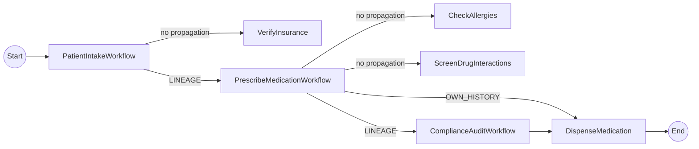

# Workflow History Propagation

This tutorial demonstrates **workflow history propagation**, a Dapr 1.18+ feature that lets a parent workflow share its execution history with child workflows and activities. Downstream services can inspect the propagated history to make trust-aware decisions — without any external state store or custom messaging. See the [Dapr docs](https://github.com/dapr/docs/pull/5153) for the feature reference.

## Scenario: Patient intake / e-prescribing

A `ComplianceAuditWorkflow` and a `DispenseMedicationActivity` refuse to act unless the propagated history proves the required upstream checks (insurance, allergies, drug interactions) actually ran.



- `PatientIntakeWorkflow` (root) calls `VerifyInsuranceActivity` (no propagation), then invokes `PrescribeMedicationWorkflow` with `propagateLineage()`.
- `PrescribeMedicationWorkflow` receives `scope=LINEAGE` with **1 ancestor** (PatientIntake). It runs allergy and interaction checks, then calls `ComplianceAuditWorkflow` with `propagateLineage()` and `DispenseMedicationActivity` with `propagateOwnHistory()`.
- `ComplianceAuditWorkflow` receives `scope=LINEAGE` with **2 ancestors** (PatientIntake + PrescribeMedication). It uses `getLastActivityByName(...)` to verify each required upstream activity completed, then approves.
- `DispenseMedicationActivity` receives `scope=OWN_HISTORY` with **1 ancestor** (PrescribeMedication only). The grandparent PatientIntake is intentionally not visible (trust boundary).

## Java API surface

```java
import io.dapr.durabletask.ActivityResult;
import io.dapr.durabletask.HistoryPropagationScope;
import io.dapr.durabletask.PropagatedHistory;
import io.dapr.durabletask.WorkflowResult;
import io.dapr.workflows.WorkflowTaskOptions;

// Parent — propagate LINEAGE when calling a child workflow
AuditResult audit = ctx.callChildWorkflow(
    ComplianceAuditWorkflow.class.getName(),
    rec,
    /* instanceId */ null,
    WorkflowTaskOptions.propagateLineage(),
    AuditResult.class).await();

// Parent — propagate OWN_HISTORY when calling an activity
DispenseResult dispense = ctx.callActivity(
    DispenseMedicationActivity.class.getName(),
    rec,
    WorkflowTaskOptions.propagateOwnHistory(),
    DispenseResult.class).await();

// Receiver (child workflow or activity) — read the propagated history
Optional<PropagatedHistory> historyOpt = ctx.getPropagatedHistory();
historyOpt.ifPresent(history -> {
    history.getScope();         // HistoryPropagationScope (LINEAGE | OWN_HISTORY)
    history.getWorkflows();     // List<WorkflowResult> — ancestor first, then own

    Optional<WorkflowResult> intake = history.getLastWorkflowByName(
        PatientIntakeWorkflow.class.getName());
    intake.flatMap(wf -> wf.getLastActivityByName(VerifyInsuranceActivity.class.getName()))
          .map(ActivityResult::isCompleted);
});
```

## Run the tutorial

1. Use a terminal to navigate to the `tutorials/workflow/java/history-propagation` folder.
2. Build and run the project using Maven. This spins up a Dapr sidecar via Testcontainers.

    ```bash
    mvn spring-boot:test-run
    ```

### Scenario 1 (happy path): lineage forwarded — pharmacy dispenses

3. Use the first POST request in the [`history-propagation.http`](./history-propagation.http) file, or use this cURL command:

    ```bash
    curl -i --request POST \
      --url http://localhost:8080/start \
      --header 'content-type: application/json' \
      --data '{
        "patientId": "P-1042",
        "name": "Jane Doe",
        "condition": "bacterial sinusitis",
        "medication": "amoxicillin",
        "dosage": 500,
        "propagateHistory": true
      }'
    ```

    The app logs should show the propagation markers proving the feature works:

    ```text
    i.d.s.e.h.PatientIntakeWorkflow         : PROPAGATION-DEMO: root workflow received no propagated history (expected)
    i.d.s.e.h.PrescribeMedicationWorkflow   : PROPAGATION-DEMO: scope=LINEAGE workflows=1
    i.d.s.e.h.ComplianceAuditWorkflow       : PROPAGATION-DEMO: scope=LINEAGE workflows=2
    i.d.s.e.h.ComplianceAuditWorkflow       :   upstream activity VerifyInsurance: completed=true
    i.d.s.e.h.ComplianceAuditWorkflow       :   upstream activity CheckAllergies: completed=true
    i.d.s.e.h.ComplianceAuditWorkflow       :   upstream activity ScreenDrugInteractions: completed=true
    i.d.s.e.h.ComplianceAuditWorkflow       : APPROVED (risk=0.10, 2 workflow(s) verified)
    i.d.s.e.h.a.DispenseMedicationActivity  : PROPAGATION-DEMO: scope=OWN_HISTORY workflows=1
    i.d.s.e.h.a.DispenseMedicationActivity  : DISPENSED: rx-P-1042-... (amoxicillin 500mg) for patient P-1042
    ```

4. Fetch the output with the GET request in the .http file, or:

    ```bash
    curl --request GET --url http://localhost:8080/output
    ```

    Expected:

    ```json
    {"dispensed":true,"dispenseId":"rx-P-1042-<ts>","patientId":"P-1042","medication":"amoxicillin"}
    ```

### Scenario 2 (failure): lineage withheld — pharmacy refuses

When `propagateHistory` is `false`, `PatientIntakeWorkflow` invokes `PrescribeMedicationWorkflow` **without** propagation options. `ComplianceAuditWorkflow` then receives no PatientIntake events in its propagated history, can't verify `VerifyInsurance` ran, and blocks the prescription.

5. Use the second POST request in the .http file, or:

    ```bash
    curl -i --request POST \
      --url http://localhost:8080/start \
      --header 'content-type: application/json' \
      --data '{
        "patientId": "P-2087",
        "name": "John Roe",
        "condition": "strep throat",
        "medication": "penicillin",
        "dosage": 500,
        "propagateHistory": false
      }'
    ```

    The app logs show the audit failing because it cannot find the upstream `VerifyInsurance` activity in the propagated history:

    ```text
    i.d.s.e.h.PatientIntakeWorkflow         : Calling PrescribeMedicationWorkflow WITHOUT propagation (failure scenario)
    i.d.s.e.h.PrescribeMedicationWorkflow   : Starting prescription: penicillin 500mg for strep throat
    i.d.s.e.h.ComplianceAuditWorkflow       : PROPAGATION-DEMO: scope=LINEAGE workflows=1
    i.d.s.e.h.ComplianceAuditWorkflow       :   upstream activity VerifyInsurance: completed=false
    i.d.s.e.h.ComplianceAuditWorkflow       :   upstream activity CheckAllergies: completed=true
    i.d.s.e.h.ComplianceAuditWorkflow       :   upstream activity ScreenDrugInteractions: completed=true
    i.d.s.e.h.ComplianceAuditWorkflow       : BLOCKED - missing upstream checks: insurance=false allergies=true interactions=true
    i.d.s.e.h.PrescribeMedicationWorkflow   : Audit blocked dispensing - aborting prescription
    ```

6. Fetch the output:

    ```bash
    curl --request GET --url http://localhost:8080/output
    ```

    Expected:

    ```json
    {"dispensed":false,"dispenseId":null,"patientId":"P-2087","medication":"penicillin"}
    ```

7. Stop the application by pressing `Ctrl+C`.
